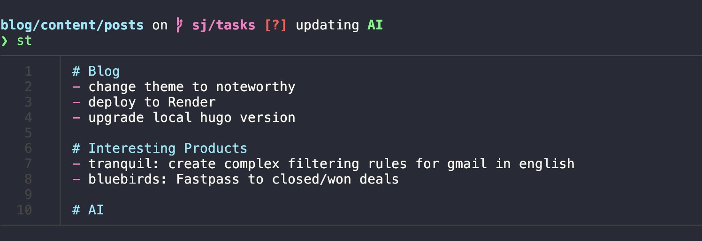

# Tasks

Productivity without context switching.



## Install

* Clone this repo `git clone git@github.com:joshi4/tasks.git`
* Update your `.zshrc` or `.bashrc` file to source `/path/to/tasks/tasks.sh`

### Dependencies

* [bat](https://github.com/sharkdp/bat)
* GNU sed

## Usage

Add a short-task

```sh
> st this is a short task
```
-----

Set a task context and add multiple tasks

```sh
> lt ctx AI

> lt read the Attention is all you need paper

> lt read the LoRA and QLoRA papers

> lt understand huggingface's peft lib

> lt done
```

-----

View a summary of all pending tasks

```
> tasks
```
----
